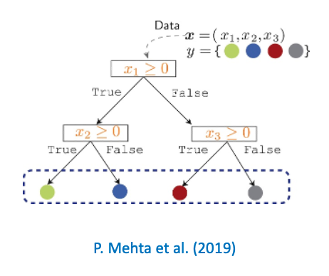
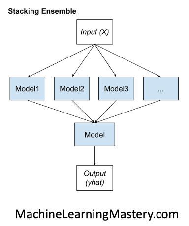

# Performance of Random Forest (RF) vs Gradient Boosting (GB) vs stacking RF + GB, on Regression and Classification. 

Final Project Computational Physics (PHY381C Fall 2022) 

Authors: D. Stek, I. Jokhadze, M. Contreras Cossio

##  Quick Setup

To build and install the GUI, please perform the following steps:

1. Download the repository 

`git clone https://github.com/micontre/boosted_random_forest.git`


2. Create an anaconda virtual environment.  This only needs to be done once per installation instance of Python!

```
conda create --name brf
source activate brf

conda install -c anaconda numpy
conda install -c conda-forge matplotlib
conda install -c conda-forge pandas
conda install -c conda-forge scikit-learn
conda install -c conda-forge
```

3. Once the environment is installed, it can be activated with the following command

`source activate brf`

4. The main file is `main.ipynb`

## Description of the scripts


## Ensembles
Ensemble models take multiple models (called “weak learners”) and combine them to get a more powerful model.
### Decision tree 
A decision tree uses a series of questions to hierarchically partition the data. Each branch consists of a question that splits the data into smaller subsets.



###  <ins>Bagging </ins>
Bagging (bootstrap aggregating), is the process of creating and merging a collection of independent, parallel decision trees using different subsets of the training data.

For Continuous predictors the ensemble aggregate predictor is the average:


$$
\hat{g}^A_L(x) = \frac{1}{M}\sum_{i = 1}^{M} {g_L(x)}
$$

Where $L$ is a dataset that is divided into $𝑀$ smaller datasets ${L_1,…,L_𝑀}$.

For the classification tasks, where each predictor predicts a class label , this is just a majority vote of the predictors,

$$
\hat{g}^A_L(x) = \text{arg max} \sum_{i = 1}^{M} {I |g_L(x)=j|}
$$
Where $I |g_L(x)=j|$ is an indicator function.
                         


***Random Forest***

The random forest algorithm is an extension of the bagging method as it utilizes both bagging and feature randomness to create an uncorrelated forest of decision trees.

### <ins> Boosting </ins>

In bagging, the contribution of all predictors is weighted equally in the bagged predictor. In boosting each classifier is associated with a weight $w_k$

$$
g_A(x) = \sum_{k = 1}^{M} {w_k g_L(x)}
$$

In boosting the ensembles are created by adding new decision trees to the ensemble.


***Gradient Boosting***

In Gradient-Boosted Trees at each step the gradient of a cost function with respect to the predicted value is computed and new trees are added that moves the value  in the direction of the gradient.

### <ins> Stacking </ins>

In stacking model one can attack a learning problem with different types of models which are capable to learn some part of the problem, but not the whole space of the problem. 

Multiple different learners can be built and used to build an intermediate prediction, one prediction for each learned model. Then a new model is added which learns from the intermediate predictions the same target.

This final model is said to be stacked on the top of the others. Thus, the overall performance can be improved, and often the model is better than any individual intermediate model.



## Bagging vs. Boosting vs. Stacking

* Random forest – works better with a few, deep decision trees has a short fit time but a long predict time.
* Gradient boosting – Works better with multiple, shallow decision trees has a long fit time but short predict time.
* Stacking Models – hard to interpret meaningfully usually they are top performing models.

** If the priority is not interpretability of a model, but high accuracy – ensemble models are highly desirable. 


## Reference Documentation

* P. Mehta et al. “A high-bias, low-variance introduction to Machine Learning for physicists”, Physics Reports, 819: 1-124 (2019).
* T. Hastie et al. “The elements of statistical learning: data mining, inference and prediction Springer, 2 edition, (2009).
* Breiman, L. “Random Forests”. Machine Learning, 45: 5–32 (2001)
Breiman, L. “Bagging Predictors”. Machine Learning, 24: 123–140 (1996)

